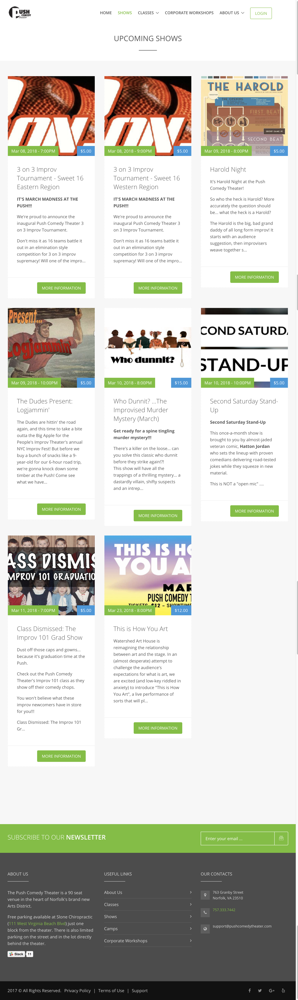
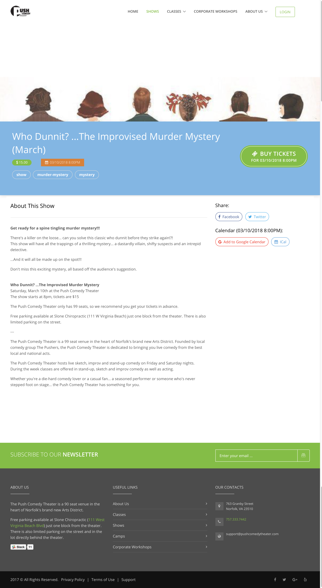
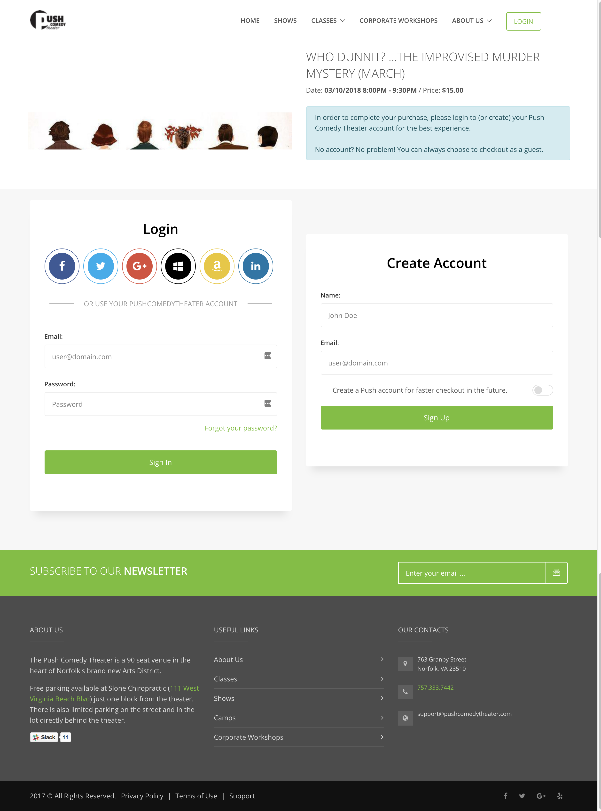
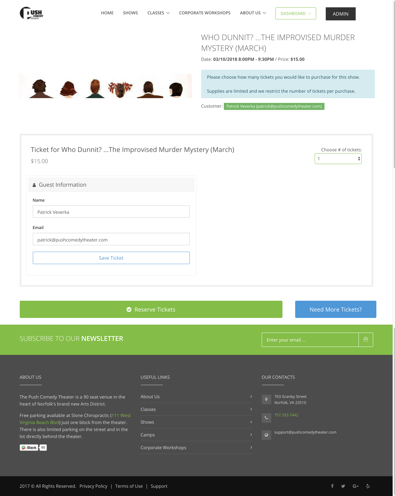
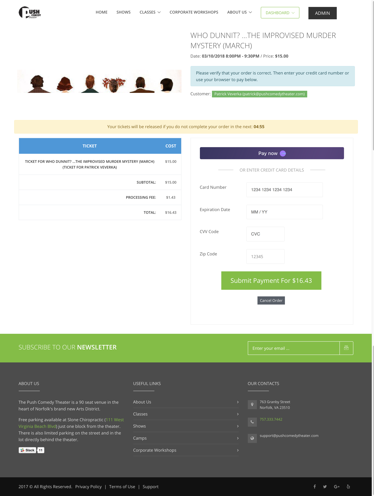
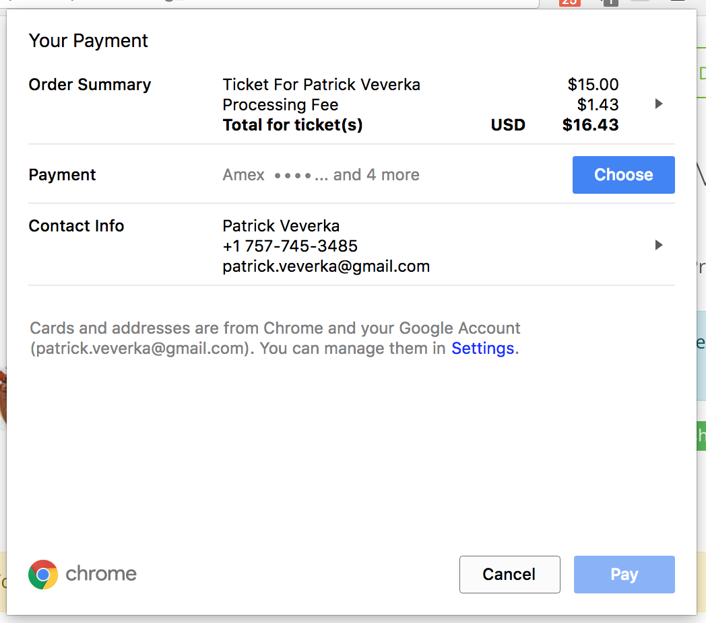
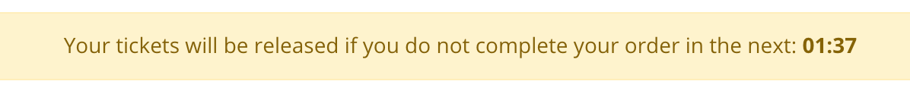
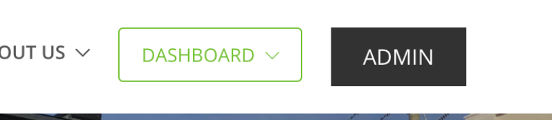
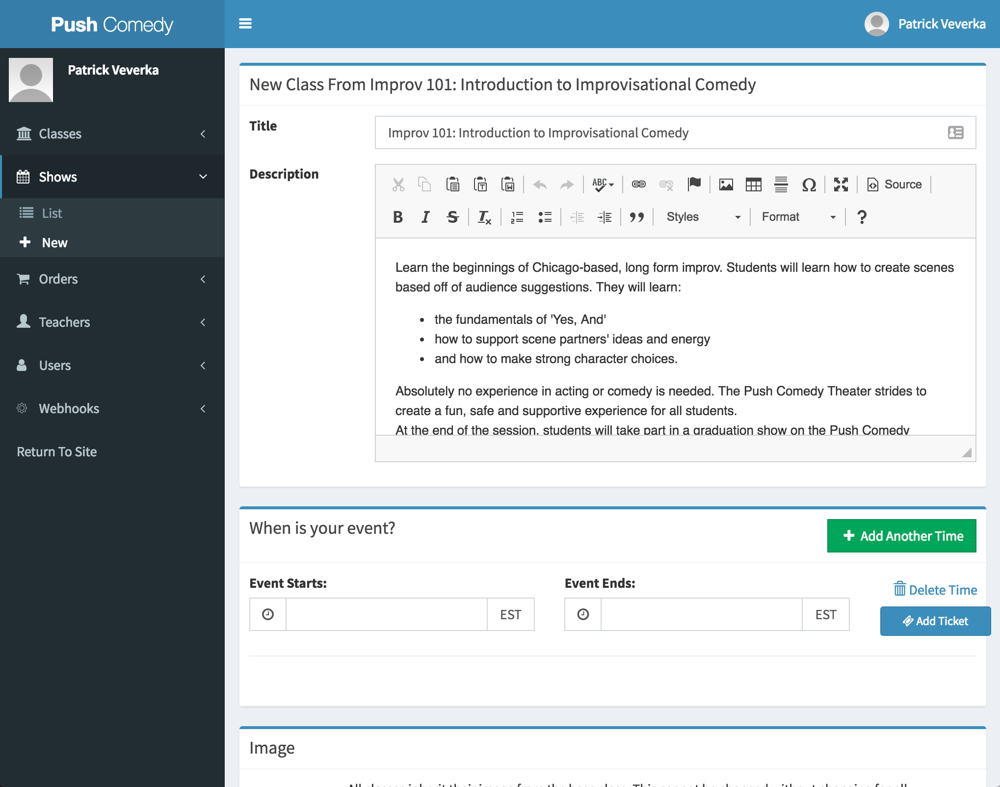

# Basic terminology

There was an attempt to keep as much of the nomenclature as possible from our previous incarnation.  However, now is a good time to go over some of the terminology of our application.

We have two types of objects that we sell tickets for - **events** and **classes**.  Everything on our site comes from one of those types.  

**Events** have many **listings** associated with them.  For example, we have an event called *"Who Dunnit? ... The Improvised Murder Mystery"*.  This event happens every month and we sell tickets to those individual occurrences of this show called **listings**.  

Likewise, we have **classes** listed on our site.  These **classes** have **listings** which are the individual instances of a class.  For example, *Improv 101* is a **class** that we offer and it has a **listing** offered from March 4 - April 8th.

# Homepage

The homepage of our site has navigation items to Shows, Classes, Corporate Workshops and About us.

Additionally, a user can login to the site and access parts of the site such as their dashboard and list of orders.  We will leverage this authentication later to add member only information.

# Show Listing

When a user visits the Shows page, they will see a dynamic listing of upcoming shows.  These will be autorefreshed when new shows are added and listings will auto-expire as they pass.

Clicking through any of these will take the user to a page with more information and a Call To Action button to purchase tickets.  Additionally, the user can add the listing to their calendar and share to Facebook or Twitter.

If they decide that they want to purchase a ticket and click on the green Buy Ticket button, they are taken into the purchase flow.  At this point, much like our previous ticket processing application, the user is given the ability to login or checkout as a guest.  If they login to a PushComedyTheater.com account, they must provide a name, an email address and a password.  They can checkout as a guest by providing their name and email address.  If they have used that email address previously, we send them an email with a one time link in it to login to that email address.

We allow the user to also use their social network accounts so that they don't have to remember any new passwords.  We have login from Twitter, Facebook, Google, Amazon, LinkedIn, and Microsoft.

After logging in, the user must select how many tickets they would like and fill out basic information (name and email) for each ticket.  Unlike our previous solution, we do not send emails to people in this flow.

On the next page, the user is prompted to enter their credit card details.  Alternatively, users may instead use the built-in payment details from their browser by clicking on the Pay Now button. 

If they choose to use the builtin payment button, they will be prompted by their browser.

What is nice about this is that it has built-in Apple Pay and Android Pay if they are on their phones.

We require the user to complete their checkout in 5 minutes.

# Administration Panel

The administration panel of the application can be reached by going to https://MAINURL/admin

This part of the website is protected and will require an account.  If you are unable to see the administration panel after logging it, please contact Patrick.

You can login to the site by clicking LOGIN in the upper right hand corner of the page.  

After you are logged into the site, you can always return to the administration portion by clicking on the Admin button in the top right corner.

Our administraton panel has a different visual layout than our normal site to help differentiate it.  That way you will know what page you are on.

## Menu

Along the left hand side of the administration panel is a menu that can lead you to different parts of the application.

1. Classes
2. Shows
3. Orders
4. Teachers
5. Users
6. Webhooks

### Classes

It is important to understand that there are a